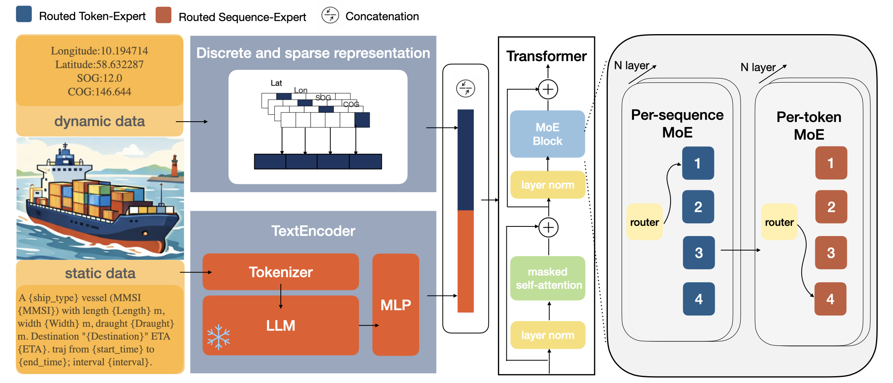

# M³-Former  
**Multi-modal, Multi-scale, and Mixture-of-Experts Transformer for Long-Term Vessel Trajectory Prediction**

Official implementation of **M³-Former**, a multimodal trajectory prediction framework that integrates:

- **Large Language Model (LLM)-based semantic encoding**
- **Dual-granularity Mixture-of-Experts (MoE) routing**
- **Spatial token generation**
- **Long-term vessel trajectory forecasting**

---

## Overview

M³-Former is designed for **long-term vessel trajectory prediction** by jointly modeling:

- historical AIS motion sequences
- vessel static attributes
- destination semantics
- global navigation intent
- local maneuvering dynamics

The framework introduces a **dual-granularity MoE architecture**, where:

- **Per-Sequence experts** capture global route planning
- **Per-Token experts** refine local motion patterns

---

## Model Architecture



---

## Installation

### 1. Create a conda environment

```bash
conda create -n m3former python=3.10 -y
conda activate m3former
```


### 2. Install  dependencies

```bash
pip install -r requirements.txt
```

---

# Model Checkpoints

checkpoint are hosted on Hugging Face.

https://huggingface.co/zero9998/M3-former/

Example usage:

```bash
--checkpoint zero9998/M3-former
```

The model will automatically download from Hugging Face.

---

# Inference


You can directly use the preprocessed test dataset `dataset/test.csv`.

```bash
python infer.py 
    --checkpoint 'zero9998/M3-former' 
    --test_csv 'dataset/test.csv'

```